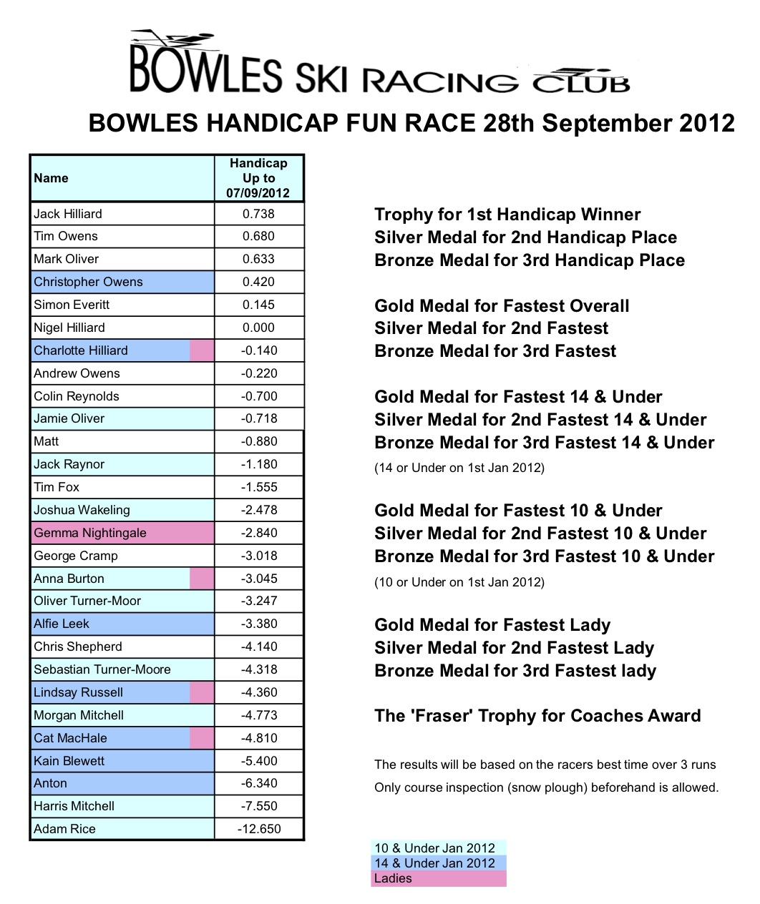

We will be holding our AGM and fun Ski race on Friday 28th September, with pizzas and medals presented at Bowles after the race.

If you are intending to attend and have not already done so, can you please email Nigel to let him know.

Times will be based on the fastest of 3 runs, with a course inspection (snowplough) allowed in advance. The medals will consist as usual of the following:

* Handicap - Winner, Silver and Bronze
* Fastest Overall - Gold, Silver & Bronze
* Fastest 14 & Under - Gold, Silver and Bronze
* Fastest 10 & Under - Gold, Silver and Bronze
* Fastest Lady - Gold, Silver & Bronze
* The 'Fraser' Trophy for Coaches Award

The 14 & Under / 10 & Under classes are based on age on 1st January 2012. The current handicaps (up to 7th September) are below (click through for a PDF):

