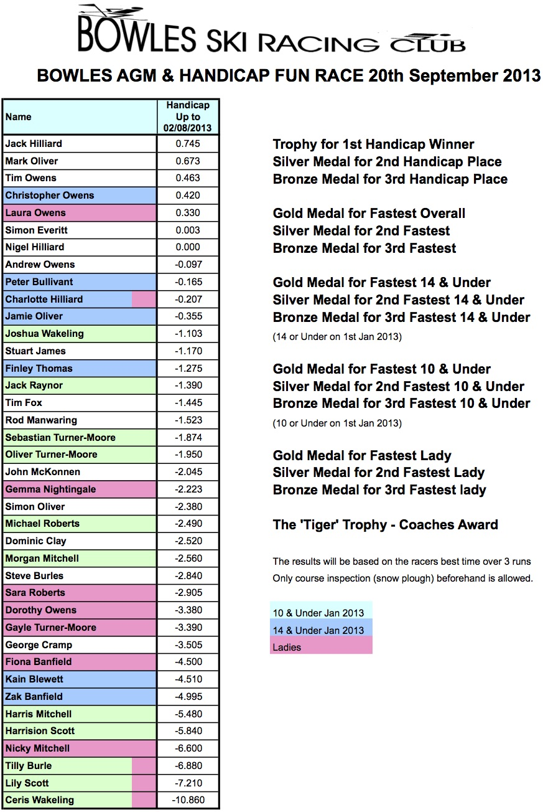

We will be holding our AGM and fun Ski race on Friday 20th September, with pizzas and medals
presented at Bowles after the race.

Times will be based on the fastest of 3 runs, with a course inspection (snowplough) allowed in
advance. The awards are as follows:

* Handicap - Winner, Silver and Bronze
* Fastest Overall - Gold, Silver & Bronze
* Fastest 14 & Under - Gold, Silver and Bronze
* Fastest 10 & Under - Gold, Silver and Bronze
* Fastest Lady - Gold, Silver & Bronze
* The ‘Tiger’ Trophy (Coaches Award)

The 14 & Under / 10 & Under classes are based on age on 1st January 2013. The current handicaps (up
to 2nd August) are below:

