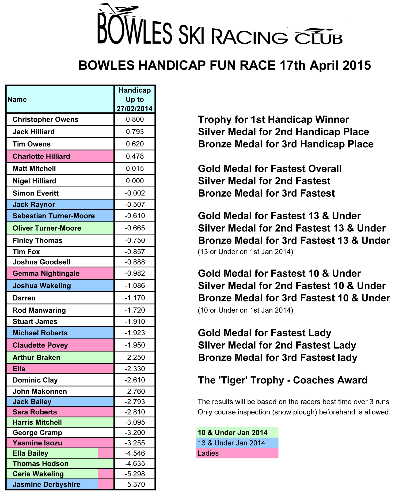

We will be holding the Bowles “Fun Race” on Friday 17th April, with pizzas and medals presented
after the race.

Times will be based on the fastest of 3 runs, with a course inspection (snowplough) allowed in
advance. The awards are as follows:

* Handicap - Winner, Silver and Bronze
* Fastest Overall - Gold, Silver & Bronze
* Fastest 13 & Under - Gold, Silver and Bronze
* Fastest 10 & Under - Gold, Silver and Bronze
* Fastest Lady - Gold, Silver & Bronze
* The ‘Tiger’ Trophy (Coaches Award)

