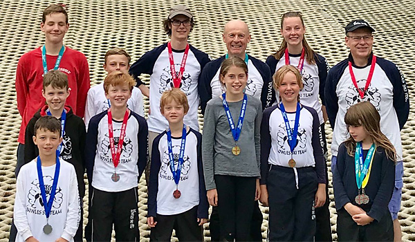

The fifth round of the Snowsports South 2018 Summer Series was held on Saturday 18th August at
Bowles. Full results are available on [Ski Results](https://skiresults.co.uk/events/893).

##### Individual Event
* Phoebe Everest - 1st in Ladies U10
* Lydia Linaker - 2nd in Ladies U10
* Rufus Wontner - 3rd in Mens U10
* Toby Everest - 1st in Mens U14
* Sam Martin-Young - 3rd in Mens U14
* Joshua Wakeling - 2nd in Mens U18
* Charlotte Hilliard - 2nd in Ladies U21
* Claudette Povey - 1st in Ladies Seniors
* Jack Hilliard - 1st in Mens Seniors
* Mark Oliver - 2nd in Masters 2

##### Fun Team Event
* Lydia Linaker and Nigel Hilliard were members of the 2nd-placed team Charlie
* Joseph Pannell was a member of the wining team Delta

##### Club Team Event
* Bowles A (Ben Wontner, Charlotte Hilliard, Jack Hilliard and Mark Oliver) were second in the
club teams competition

##### Honorable Mentions
* Joseph Pannell - 4th in Mens U16
* Nigel Hilliard - 4th in Mens Masters 2

Photos in the [gallery](/gallery/2018/180818_SRSA_5_bowles).
