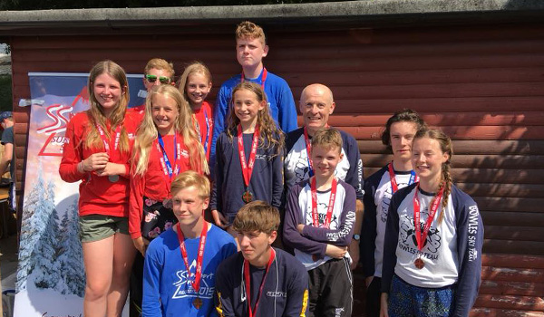

The fourth round of the Snowsports South 2018 Summer Series was held on Saturday 14th July at
Southampton. Full results are available on [Ski Results](https://skiresults.co.uk/events/892).

##### Individual Event
* Charlotte Hilliard - 2nd in Ladies U21
* Claudette Povey - 1st in Ladies Seniors
* Jack Hilliard - 1st in Mens Seniors
* Mark Oliver - 1st in Masters 2
* Nigel Hilliard - 3rd in Masters 2        

##### Fun Team Event
* Claudette Povey was a member of the 3rd-placed team Bravo

##### Club Team Event
* Bowles (Toby Everest, Charlotte Hilliard, Jack Hilliard and Nigel Hilliard) were third in the
club teams competition

##### Honorable Mention
* Toby Everest - 4th in Mens U14

Photos in the [gallery](/gallery/2018/180714_SRSA_4_southampton).
