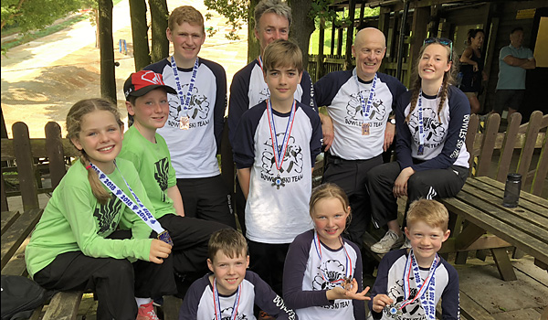

The second round of the LSERSA 2018 Summer Series was held on Saturday 2nd June at Brentwood. Full
results are available on [Ski Results](https://skiresults.co.uk/events/896).

##### Individual Event
* Stella Pople - 1st in Ladies U10
* Rufus Wontner - 1st in Mens U10
* Ollie Turner-Moore - 2nd in Mens U16
* Joshua Wakeling - 3rd in Mens U18
* Charlotte Hilliard - 2nd in Ladies U21
* Claudette Povey - 1st in Ladies Seniors
* Nigel Hilliard - 3rd in Mens Masters 2

##### Fun Team Event
* Toby Dunnet and Toby Everest were members of the winning team
* Phoebe Everest, Rufus Wontner and Bill Dunnet were members of the 2nd-placed team

##### Honorable Mention
* Phoebe Everest - 4th in Ladies U10
* Bill Dunnet - 4th in Mens Masters 2

Photos in the [gallery](/gallery/2018/180602_LSERSA_2_brentwood).