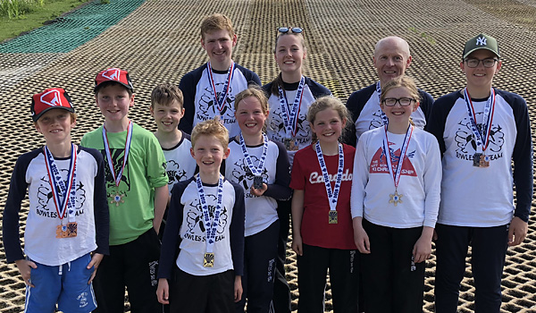

The third round of the LSERSA 2018 Summer Series was held on Sunday 10th June at Welwyn. Full
results are available on [Ski Results](https://skiresults.co.uk/events/897).

##### Individual Event
* Stella Pople - 1st in Ladies U10
* Phoebe Everest - 2nd in Ladies U10
* Rufus Wontner - 1st in Mens U10
* Ben Wontner - 3rd in Mens U12
* Ollie Turner-Moore - 2nd in Mens U16
* Joshua Wakeling - 1st in Mens U18
* Charlotte Hilliard - 1st in Ladies U21
* Mark Oliver - 1st in Masters 2
* Nigel Hilliard - 2nd in Masters 2        

##### Fun Team Event
* Cerys Wakeling and Toby Pople were members of the winning team

##### Club Team Event
* Bowles (Ben Wontner, Ollie Turner-Moore, Joshua Wakeling, Charlotte Hilliard and Nigel Hilliard)
were third in the club teams competition

Photos in the [gallery](/gallery/2018/180602_LSERSA_3_welwyn).