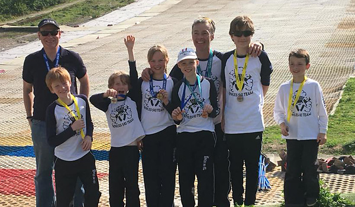

The second round of the SRSA 2018 Summer Series was held on Saturday 26th May at Chatham. Full
results are available on [Ski Results](https://skiresults.co.uk/events/890).

##### Individual Event
* Phoebe Everest - 1st in Female U10
* Rufus Wontner - 2nd in Male U10
* Toby Everest - 3rd in Male U14
* Mark Oliver - 1st in Male Masters 2
* Bill Dunnet - 2nd in Male Masters 2

##### Fun Team Event
* Bill Dunnet was a member of the 2nd-placed Team Bravo
* Toby Everest was a member of the 3rd-placedTeam Foxtrot

##### Honorable Mention
* Toby Dunnet - 4th in Male U14

Photos are in the [gallery](/gallery/2018/180526_SRSA_2_chatham).
