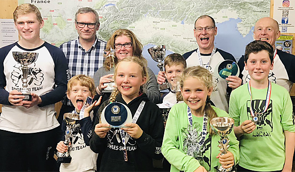

The fifth and final race of the LSERSA 2018 Summer Series was held on Saturday 13th October at
Chatham. Full results are available on [Ski Results](https://skiresults.co.uk/events/899).

##### Individual Event
* Stella Pople - 2nd in Ladies U10
* Phoebe Everest - 3rd in Ladies U10
* Rufus Wontner - 2nd in Mens U10
* Toby Everest - 3rd in Mens U14
* Joshua Wakeling - 1st in Mens U18
* Claudette Povey - 1st in Ladies Seniors
* Mark Oliver - 2nd in Masters 2

##### Fun Team Event
* Toby Pople, Joseph Pannell and Nigel Hilliard were members of the 3rd-placed team

The **overall season results** were also awarded:

##### Individual Results - 2018
* Stella Pople - 1st in Ladies U10
* Phoebe Everest - 2nd in Ladies U10
* Rufus Wontner - 1st in Mens U10
* Ollie Turner-Moore - 2nd in Mens U16
* Joshua Wakeling - 1st in Male U18
* Claudette Povey - 1st in Ladies Seniors
* Mark Oliver - 1st in Male Masters 2

##### Special Awards
* Most Improved Female - Stella Pople
* Eve Alcott Memorial Trophy - the Wakeling family

##### Honorable Mention
* Ben Wontner - 4th in Mens U12
* Nigel Hilliard - 4th in Male Masters 2

Photos in the [gallery](/gallery/2018/181013_LSERSA_5_chatham).