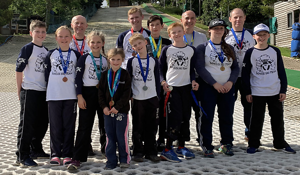

The fourth round of the SRSA 2019 Summer Series was held on Saturday 17th August at Bowles. Full
results are available on [Ski Results](https://skiresults.co.uk/events/1001).

##### Individual Event
* Charlotte Currie - 3rd in Female U8
* Marcus Pop - 3rd in Male U8
* Rufus Wontner - 2nd in Male U10
* Phoebe Everest - 3rd in Female U12
* Ben Wontner - 2nd in Male U12
* Joshua Wakeling - 3rd in Male U18
* Claudette Povey - 1st in Female Seniors
* Anthony Forte - 3rd in Male Masters 1
* Mark Oliver - 2nd in Male Masters 2
* Nigel Hilliard - 3rd in Male Masters 2

##### Club Teams
* Bowles A (Nigel Hilliard, Mark Oliver, Joshua Wakeling, Ben Wontner) were 2nd

##### Fun Teams
* Charlotte Currie, Luke Forte and Stella Pople were members of the winning team Alpha

##### Honorable Mention
* Stelle Pople - 4th in Female U12
* Cornelia Natzkoff was a member of the 4th-placed fun team Echo

Photos in the [gallery](/gallery/2019/190817_SRSA_4_bowles).