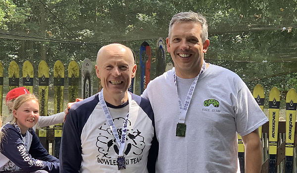

The third round of the LSERSA 2019 Summer Series was held on Saturday 20th July at Brentwood. Full
results are available on [Ski Results](https://skiresults.co.uk/events/1008).

##### Individual Event
* Charlotte Currie - 3rd in Ladies U8
* Marcus Pop - 2nd in Mens U8
* Phoebe Everest - 1st in Ladies U12
* Joshua Wakeling - 2nd in Mens U18
* Mark Oliver - 2nd in Male Masters 2
* Nigel Hilliard - 3rd in Male Masters 2

##### Fun Teams Event
* Joshua Wakeling was a member of the 3rd-placed team

##### Honorable Mention
* Toby Everest - 4th in Mens U14
* Bowles A (Phoebe Everest, Toby Everest, Nigel Hilliard, Stella Pople, Joshua Wakeling) were fourth
  in the club teams competition

Photos in the [gallery](/gallery/2019/190720_LSERSA_3_brentwood).