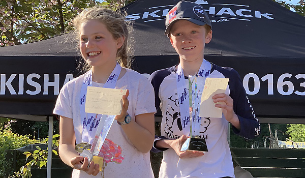

The Kent School Ski Championships were held at Chatham on Sunday 12th May.

##### Individual Event
* Rufus Wontner - 1st in Primary Junior Male
* Stella Pople - 1st in Primary Senior Female and 1st Primary Overall Female
* Ben Wontner - 1st in Primary Senior Male and 1st Primary Overall Male
* Lila Ayton - 2nd in Secondary Junior Female
* Evie Ayton - 2nd in Secondary Senior Female

##### Primary Teams
* Holmewood House (Noah Chrysostomou, Miles Green, Sophie Richmond, William Richmond) - 1st Mixed
Primary Junior Team
* Bishops Down Primary School 1 (Dylan Bentley-Bowers, Tommy Pryor, Eva Rigby, Barnaby
Weston) - 2nd Mixed Primary Junior Team
* Rose Hill (Charlotte Davidson, Matthew Davidson, Ben Wontner, Rufus Wontner) - 1st
Mixed Primary Senior Team and 1st Mixed Primary Overall Team

##### Secondary Teams
* Tunbridge Wells Girls Grammar School 2 (Lila Ayton, Katy Bentham, Harrier Dunkin, Millie 
James) - 1st Female Secondary Junior Team
* Hillview School (Amber Bowers, Georgina Prior, Erin Valance, Cerys Wakeling) - 2nd
Female Secondary Junior Team
* Tunbridge Wells Girls Grammar School 3 (Isobel Aves, Tallulah Coakley, Amelie Lagden,
Maisie Lagden) - 3rd Female Secondary Junior Team
* The Skinners' School 3 (Joshua Leake, Dominic Nutland-Frankel, James Parr, Bertie
Riolo) - 2nd Male Secondary Junior Team
* Tunbridge Wells Girls Grammar School 1 (Evie Ayton, Rebecca Forte, Sophie Green,
Kathryn Lewey) - 1st Female Secondary Junior Team and 1st Female Secondary Overall Team
* The Skinners' School 1 (Matthew Bentham, Ethan Gillespe, Joseph Pannell, Joshua
Wakeling) - 2nd Male Secondary Senior Team

##### Fun Teams
* Stella Pople and Rufus Wontner were members of the 2nd-placed primary fun team
* Amelie Lagden was a member of the 1st-placed secondary fun team
* Maisie Lagden was a member of the 2nd-placed secondary fun team
* Katy Bentham and Nate Weston were members of the 3rd-placed secondary fun team

##### Honorable Mention
* Bishops Down Primary School 2 (Alana Domzalskia, Eva Domzalski, Oliver Rigby, Ella
Stevenson) - 4th Mixed Primary Senior Team
* Lila Ayton, Luke Forte and Joe Taylor were members of the 4th-placed secondary fun team

Photos are in the [gallery](/gallery/2019/190512_kent).
