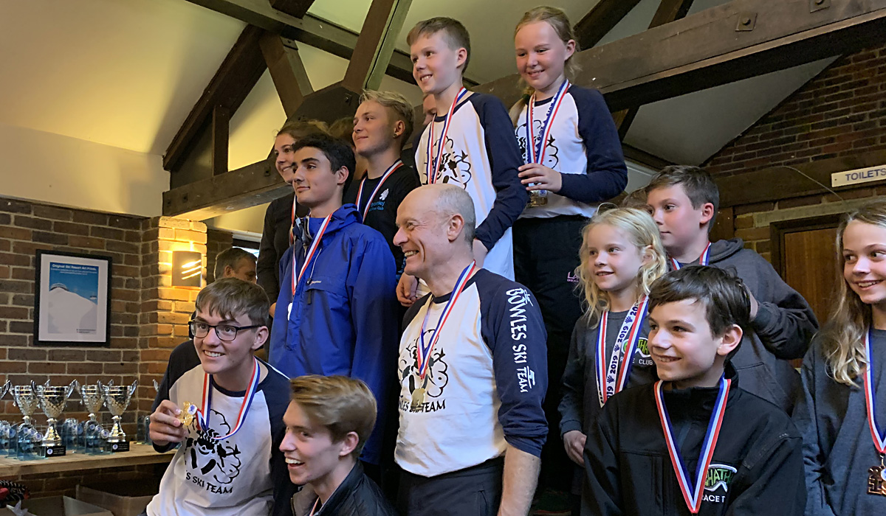

The fifth and final round of the LSERSA 2019 Summer Series was held on Sunday 29th September at
Chatham. Full results are available on [Ski Results](https://skiresults.co.uk/events/1010).

##### Individual Event
* Marcus Pop - 2nd in Mens U8
* Phoebe Everest - 1st in Ladies U12
* Stella Pople - 3rd in Ladies U12

##### Club Teams Event              
* Bowles (Phoebe Everest, Toby Everest, Nigel Hilliard, Ollie Turner-Moore and Seb Turner-Moore)
  were first in the club teams competition

##### Fun Teams Event
* Marcus Pop was a member of the winning team
* Joseph Pannell and Toby Pople were members of the 2nd-placed team
* Charlotte Currie was a member of the 3rd-placed team

##### Honorable Mention
* Charlotte Currie - 4th in Ladies U8
* Toby Everest - 4th in Mens U14
* Seb Turner-Moore - 4th in Mens U18
* Anthony Forte - 4th in Male Masters 1
* Nigel Hilliard - 4th in Male Masters 2
* Bill Dunnet was a member of the 4th-placed fun team

Trophies for the overall season were also decided

##### Season - Individual
* Charlotte Currie - 2nd in Ladies U8
* Marcus Pop - 2nd in Mens U8
* Phoebe Everest - 1st in Ladies U12
* Joshua Wakeling - 3rd in Mens U18

##### Season - Special Cups
* Nigel Hilliard - Matthew Owens Memorial

##### Season - Honorable Mentions
* Toby Everest - 4th in Mens U14
* Seb Turner-Moore - 4th in Mens U18
* Nigel Hilliard - 4th in Male Masters 2