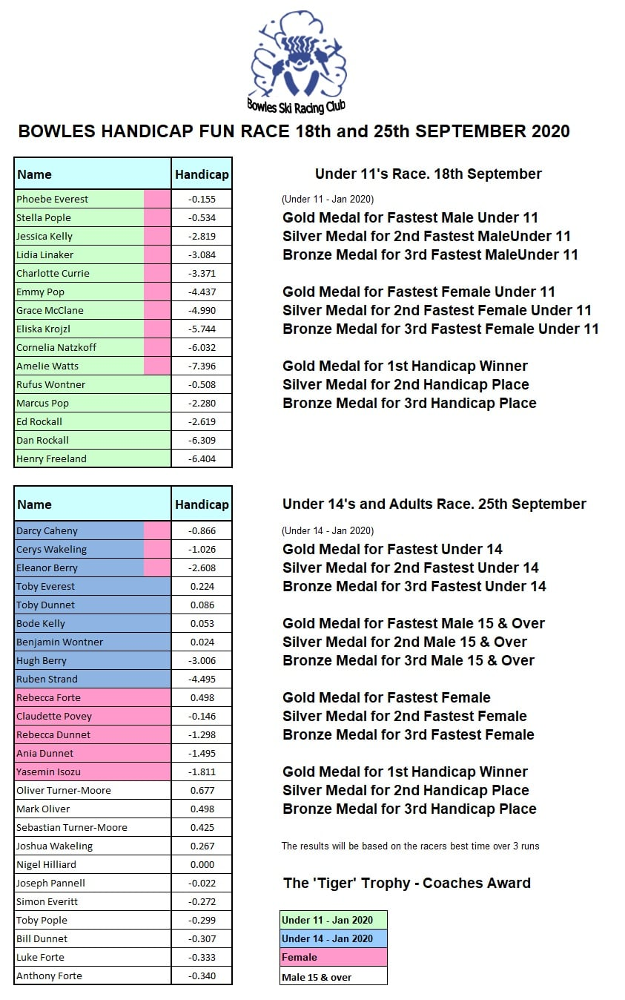

The club's autumn fun race will be taking place over Friday 18th and Friday 25th September. The 18th
will be for club members racing in the 11-and-Under category (so born between 2009-2014 inclusive),
and the 25th for older members (born 2008 or earlier).

The booking system will be "open as usual" for both sessions, but please only book in for members in
the appropriate age group (there will be a reminder on the booking page as well).

Following the Prime Minister's announcement earlier this week on new restrictions to prevent the
spread of Covid-19, SnowSport England have issued the following guidance:

### SnowSport England Guidance Update
Sep 10, 2020
> 
> While social gatherings of more than six people will be banned in England from the 14th September
> 2020, the Government has confirmed that organised sports and activities that have been through
> return to play protocols can continue, as can organised outdoor sports.
>
> People can also continue to use leisure facilities, including Snowsport facilities –
> groups/sessions within these venues can continue as they are now. People should not go to these
> venues socially in groups of more than six.
>
> The reason for this is because these we have worked hard to support facilities and clubs  to have
> stringent plans in place to reduce the risk of Covid-19, and because these venues are classed as
> Covid-secure given the measures they’ve introduced.
>
> The importance of sport and physical activity to people’s physical health and mental wellbeing
> has also been recognised by the government.
>
> Thank you for your support and patience as we continue through this challenging time.
>
>For further information please look at the [Sport England website](https://www.sportengland.org/how-we-can-help/coronavirus/return-play)
