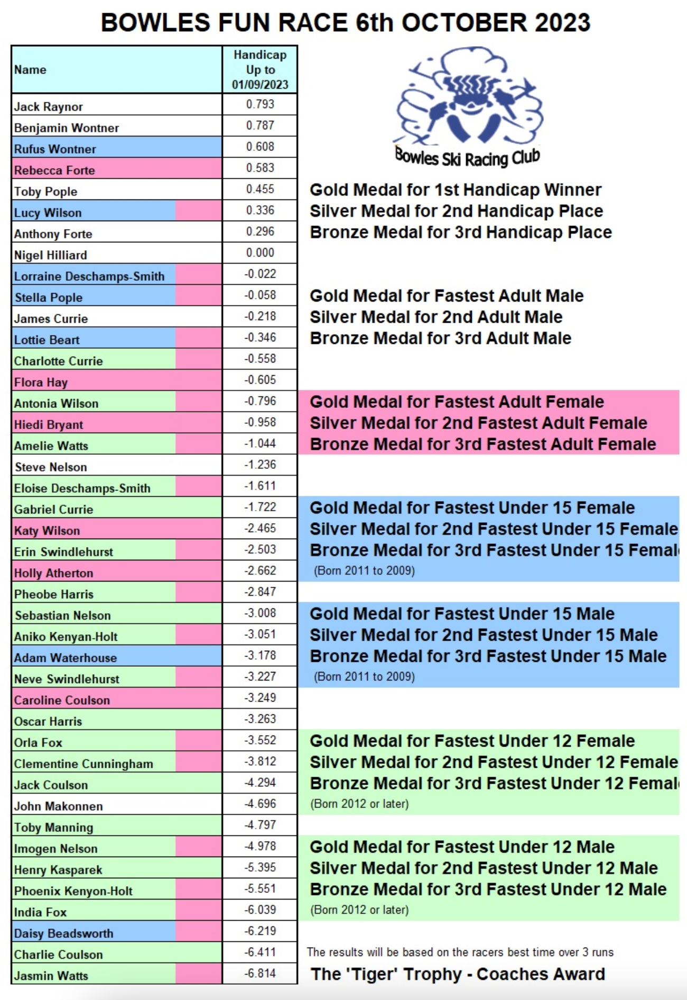

The Autumn Bowles Handicap Fun Race (aka 'Pizza Night’) will be held on Friday 6th October, followed
by the club AGM.

The race is not open to racers who **compete** for other regional dry ski clubs, but all Bowles
racers old and new can take part, and we really hope that all the new members who've joined this
year can make it along.

This friendly entry level race takes place during our usual 5.30-7.30 pm training slot, and the
handicap timed medals are very much skewed to benefit our newest racers.

The latest handicaps are:

